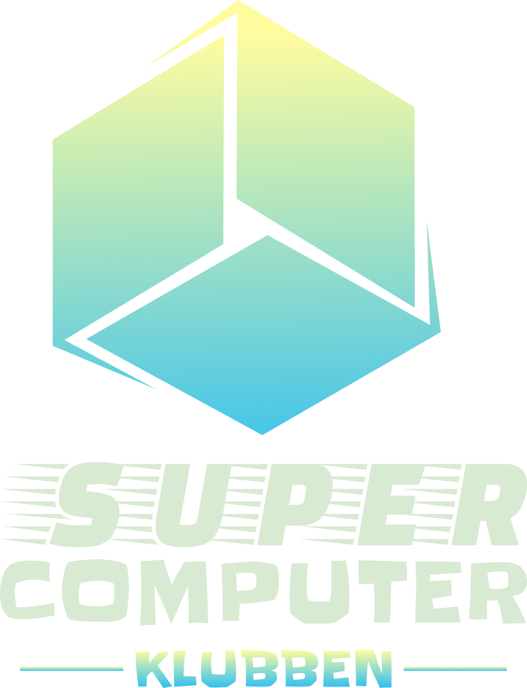
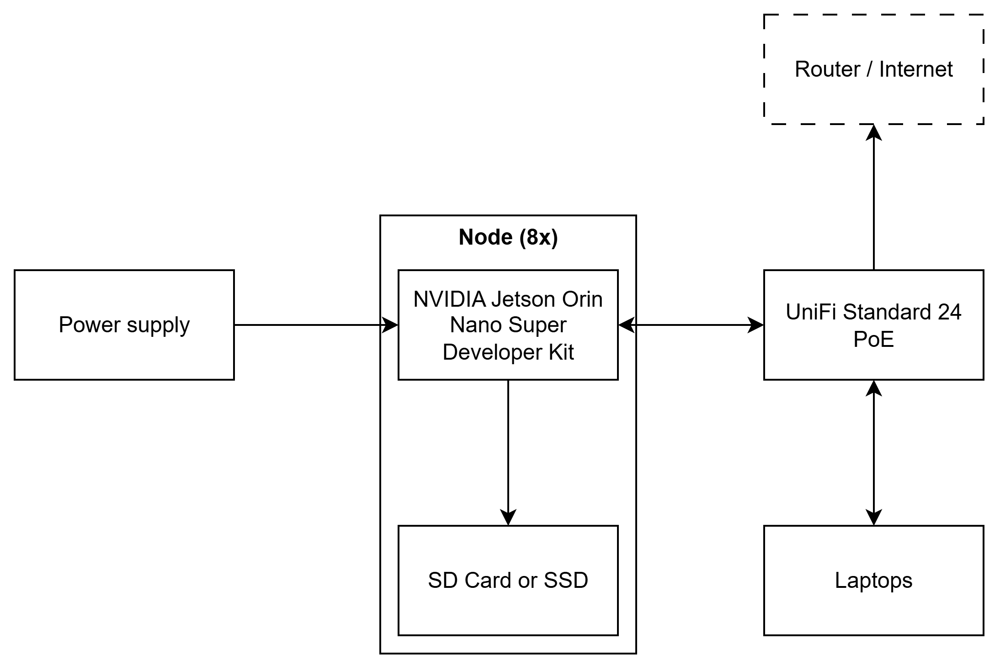

# Aalborg Supercomputer Klub

## Aalborg University 

## Diagram

## Hardware

### Power monitoring

We will livestream and record footage of a wattmeter measuring the power usage of our cluster.

### Hardware Table

|Item|Amount|Purpose|Expected Power Draw|Price|
|-|-|-|-|-|
|NVIDIA Jetson Orin Nano Super Developer Kit|8|Single-board computer|200 W|$1,992.00|
|UniFi Standard 24 PoE|1|Network switch|50 W|$349.00|
|2x Amazon Basic microSDXC - 64 GB \[1]|2|SD card (2x per unit)|N/A \[2]|$78.25|
|SanDisk Extreme microSDXC - 64 GB \[1]|4|SD card|N/A \[2]|$111.96|
|PNY CS1030 250 GB \[1]|8|SSD|N/A \[2]|$569.88|
|Meanwell UHP-350-12|1|Power supply|N/A \[3]|$80.94|

Total: $2,612.15-2,991.82 \[1]

Notes:

1. It is to be determined whether we go with SSDs or SD cards. Total is shown for both options.
2. This is attached to a node, and included in its power draw.
3. This provides power to the nodes, and so is accounted for in their power draw.

## Software

### Strategy

**Operating system:** NVIDIA Jetson Linux 36.5 - Optimized for our hardware  
**MPI:**

* NVIDIA HPC-X MPI - Open MPI implementation specifically designed for NVIDIA hardware
* Open MPI - Fallback

**BLAS:**

* cuBLAS - Can take advantage of GPUs through CUDA
* BLIS - Fallback, can build BLAS library specially optimized for our CPU

**Compiler:**

* nvcc - CUDA
* mpicc - MPI
* Clang - C/C++

**Network file share:** NFS - Gets the job done. Where speed is critical, files can be copied to each node.  
**Cluster management:**

* Ansible - Declarative, consistent and idempotent configuration across nodes
* OpenSSH - Remote access

### Benchmarks

Explain your initial strategy for completing the benchmarks.

* **HPL:** Run the NVIDIA HPC Benchmarks implementation of HPL.
* **D-LLAMA:** Try to port it to cuBLAS to run on the GPU with CUDA. Alternatively attempt to run it through Vulkan, and failing that, run it on the CPUs.
* **MDTest:** Run with local IO to optimally utilize disk performance and avoid network overhead.
* **IQ-TREE:** Optimize using the documentation on the IQ-TREE website.

### Applications

Not sure what the difference is between this and “Benchmarks”.

## Team Details

* **Brian Ellingsgaard:** Loves library interface design, array-oriented programming, and theoretical computer science related to group and information theory.
* **Emil Kristensen Vorre:** Enjoys programming with a purpose in mind. Knowledgeable about Linux.
* **Sofie Finnes Øvreild:** Well-experienced with Linux and focusing on learning tooling around superclusters. Some experience with traditional software development with C/C++.
* **Tobias Sønder Nielsen:** Experienced with Linux and basic networking. Interested in hardware and generally toying with computers.
