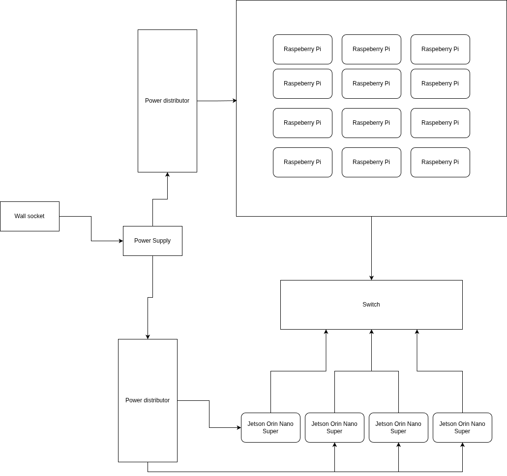

# Tech Titans

## University of Botswana 

## Diagram

## Hardware

Nvidia Jetson Orin Nano Super and Raspberry Pi 5(8gb) \- A mixed setup to get best of both worlds. HPL benchmark we can get better GFLOPs from using GPU acceleration over using CPU, D-LLAMA using the GPU is better because the are tensor cores that give a better outcome and MD-TEST due to Jetson Orin Nano Super accepting NVME which gives better performance for the benchmark as well as reducing the bottleneck. Since IQ-tree requires cores we have the Raspberry Pi’s to do this benchmark 

## Power monitoring

To track the total 250W limit for the entire setup (including the switch and fans), we install a professional-grade energy meter like the Shelly Pro 3EM at the main power input. We will then run a Shelly Prometheus Exporter on our head node, which queries the Shelly API to pull aggregate metrics like shelly\_total\_power\_watts into our time-series database.  
Finally we configure a central Grafana Dashboard to unify these data sources. This allows us to create a "Live Power Meter" gauge that turns red as you approach 240W, while simultaneously graphing "Watts per GFLOPS" to prove the efficiency of our heterogeneous architecture to the committee.

## Hardware Table

| Item | Amount | Expected Power Draw | Price Per Unit |
| :---- | :---- | :---- | :---- |
| Raspberry Pi 5 (8gb) | 12 | 144W | 136 |
| Nvidia: Jetson Orin Nano Super | 4 | 80W | 249 |
| SanDisk Extreme 128GB MicroSD | 12 |  | 40 |
| Samsung 970 EVO Plus SSD 500GB | 4 |  | 140 |
| TP-Link 24-Port Gigabit Ethernet Unmanaged Switch | 1 | 13.1 | 90 |
| Shelly Pro 3EM 3CT 63 | 1 |  | 100 |
| DC Power Fuse Distribution Strip Module (6 Position, DIN Rail Mount) | 1 |  | 28 |
| DC Power Fuse Distribution Strip Module (12 Position, DIN Rail Mount) | 1 |  | 38 |
| Rapink Patch Cables Cat6 | 2 |  | 21 |
| Electrical Wire 14 AWG 14 Gauge Silicone Wire Hook | 16 |  | 10 |
| USB C to 2 Pin Bare Wire Open End Power Cable | 12 |  | 10 |
| GeeekPi Cluster Case for Raspberry Pi \- Stackable 12-Layer Rack With Cooling Fan | 2 | 5W | 83 |
| Fancasee 16AWG DC Power Pigtail Cable, 5.5mm x 2.5mm DC Barrel Male Plug | 4 |  | 7 |
| **Total** |  |  | 4350 |

		

## Software

**OS:** Ubuntu 24.04 LTS (Pi) and JetPack 6.2 (NVIDIA).  
**Orchestration:** **Slurm** for job scheduling and resource allocation. **Ansible** to automate the management of all nodes  
**Containerization:** **Singularity/Apptainer** to ensure benchmark reproducibility across different ARM architectures.  
**Implementation: cuBlas** because I want to utilise the GPU. **MPCHI** for its predictability in arm architecture   
**Rationale:** Slurm allows us to define "partitions" so that **D-LLAMA** jobs are automatically routed to the NVIDIA nodes while **IQ-TREE** scales across the Pi worker nodes.

## Strategy

### **Benchmarks**

* HPL: We will use the CUDA-accelerated HPL on the Jetson nodes. By offloading matrix decomposition to the 4,096 CUDA cores, we expect to achieve GFLOPS results that a CPU-only Pi cluster cannot reach.  
* No D-LLAMA: Our strategy involves distributed inference using llama.cpp with the RPC backend. The Jetsons will serve as the primary compute engines (using Tensor cores), while the Pis manage context and orchestrate the request stream.

### **Applications**

* MDTest: We will run this specifically on the NVIDIA Tier using the NVMe SSDs. Testing metadata performance on SD cards is a bottleneck; using the MB/s throughput of the NVMe drives will maximize our IOPS score.  
* IQ-TREE: We will utilize the 12-node Raspberry Pi tier. Since IQ-TREE is highly parallel and CPU-bound, we will launch multiple instances across the 48 available Pi cores to find the maximum likelihood trees in parallel.

## Team Details

Theo Kgosiemang \- Fourth year computer science student interested in all things software engineering.

Jonathan Mosoma \- Second year computing with finance student Interested in HPC and performance engineering.

Pholoso Lekagane- Fourth Year Computer Science undergrad looking to expand their skill set

Chandapiwa Malema:Fourth year computer  student with an interest in HPC 

Mehedi Hasan Mahin- Third year computer science student and interested in Artificial Intelligence.

Ray Mcmillan Gumbo- Third year computer science student with an interest in Artificial Intelligence