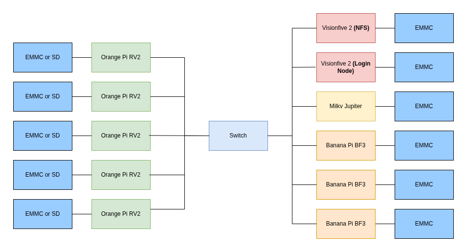

# HPC Brazil Force

## Federal University of Pampa / Federal University of Rio de Janeiro / UNICAMP / Federal University of Santa Maria

## Diagram

## Hardware

The hardware is composed of a mix of single-board computers, including:
1x Milky Jupiter,
3x Banana Pi BF3,
5x Orange Pi RV2,
2x Visionflove 2.
The hardware was chosen based on student availability and cross-compatibility. The boards with lower processing capacity are used for support functions, such as the Login Node and service provisioning, including NFS. The boards with higher computational power, in turn, act as compute nodes and are responsible for executing the cluster workloads.

### Power monitoring

The cluster’s power consumption will be measured using an external wattmeter connected between the power supply and the system. The device will measure the total power draw of the entire cluster during benchmark execution. Readings will be monitored in real time on the wattmeter display. For transparency, we can provide livestreamed or recorded video of the display during the runs, allowing the committee to validate the measurements. We are available to adjust the reporting format as requested by the committee.

### Hardware Table

| Item | Amount | Purpose | Expected Power Draw (per unit) | Approx. Price (per unit) |
|------|--------|---------|--------------------------------|--------------------------|
| Milky Jupiter - 16GB | 1 | High-performance worker node| 15–25W | $150–200 |
| Banana Pi BPI-F3 - 8/16GB | 3 | High-performance worker nodes | 8–15W | $80–110 |
| Orange Pi RV2 - 8G | 5 | Standard worker nodes | 5–10W | $40–60 |
| VisionFive 2- 8G | 2 | Login node, NFS, DHCP and other services | 5–10W | $70–90 |
| HP 1410-24G Gigabit Switch  | 1 | Network Switch | 22W | $250-320 |
| 16GB  EMMC Module | 3 | Storage for SBCs | | $25-30 |
| 32GB SD Card | 8 | Storage for SBCs | | $5-7 |
| 12V power suply | 9 | Power supply for SBCs | | $3-4 |
| 5V power suply | 2 | Power supply for SBCs | | $3-4 |

## Software

The cluster runs a fully RISC-V software stack based on open-source tools.

### Linear Algebra

* **BLAS:** OpenBLAS

### Compilers

* GCC
* G++
* MPICC
* MPIC++

### MPI

* Open MPI

### Build System

* CMake

### Operating Systems

* **Bianbu 25.04** (Ubuntu 25.04–based distribution by Spacemit)
  Used on:

  * Milk-V Jupiter
  * Banana Pi BPI-F3
  * Orange Pi RV2

* **Debian 13**
  Used on:

  * VisionFive 2

All software components are compiled natively for RISC-V with architecture-specific optimization flags.

## Strategy

#### Benchmarks

1) High-Performance Linpack (HPL)

We intend to conduct a systematic parameter exploration across different quantities of core machines, focusing on identifying optimal configurations for HPL performance. This preliminary phase will combine theoretical algorithm analysis with empirical validation, using the HPL documentation tuning guidelines as a reference. The main objective is to find the best parameter values, especially for block size (NB), process grid dimensions (P × Q), factorization methods, and broadcast algorithms, which seem to have a significant impact on performance.

2) D-LLAMA

For this benchmark challenge, we will adopt an approach similar to that used for HPL, testing parameters and different configurations exploratorily to identify the combination that delivers the best performance.

3) MDTest. 

To achieve the best performance in MDTest, we plan to explore different numbers of MPI processes and workload sizes, adjust filesystem configurations such as directory striping, and test multiple distribution strategies across nodes. We will also minimize background activity and repeat runs to ensure consistent and reliable results.

### Applications

1) IQ-TREE Application
The team will utilize MPI to parallelize IQ-TREE, aiming to reduce communication overhead and improve workload distribution across nodes.

2) Mystery Application
The team will collaboratively analyze the assigned software and determine the most effective deploym# HPC Brazil Force 

### Team Details

**Bruna Righi**: Interested in HPC and eHealth. Research focuses on current eHealth developments and improvements.

**Julio Avelar**: Interested in computer architecture,
digital systems design, and HPC. Research focuses
on scalable verification and categorization of open-
source RISC-V processors.

**Mariana Fernandes**: Research in concurrent systems testing.
Interested in high-performance green computing.
Already working in the technology area with
experience in debugging.

**Mariana Padilha**: Interested in IoT and HPC. Her research
focuses on flow simulation in porous media using
Fortran, OpenMP/C, and CUDA.ent strategy for the cluster.