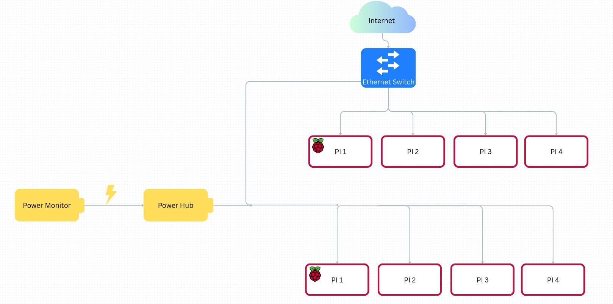

# RAMbo Clements

## Clemson University / Coastal Carolina University

## Diagram

## Hardware

We will use 16 Raspberry Pi 4B devices for our cluster setup. We don’t have additional funding for stronger hardware, but we plan to maximize the resources that we have available and demonstrate the potential gains of using cheaper hardware. There is a potential for adding an NVIDIA Jetson before the competition.

### Power monitoring

Last year, we used livestreamed webcam footage of our cluster setup. We also reported our power draw with an energy-meter connected to the power supply for our cluster. We plan to follow a similar arrangement this year.

### Hardware Table 

Example: 

| Item | Amount | Purpose | Expected Power Draw | Price|
| -------- | ------- |------- |------- |------- |
| Raspberry Pi 4B  | 16    |  General applications | 160 W | $640 |
| NETGEAR 24-Port Gigabit Ethernet Unmanaged Switch (JGS524) | 1     | Connecting our cluster | n/a | $150|

## Software

Our software stack uses MPI to distribute the workload of our applications to CPU cores across our entire cluster, and Spack to install and manage packages in a way that runs quickly and efficiently by compiling many libraries without breaking dependencies. Since we don't have a job manager, MPI CLI allows us to dynamically manage resource allocations. Using this, we can easily manage our resources and compute time. In HPC it’s essential for efficient, point-to-point and collective communication between processes. Spack’s non-destructive approach to compilation allows us to install packages into unique directories so that multiple versions can coexist, and its lack of a root requirement allows users to install software to their home environment, which makes it ideal for a shared HPC environment. Similarly, NSF allows us to access, view, and store files on remote network computers as if they were stored locally. It’s excellent for centralizing storage and improving scalability.

## Strategy

### Benchmarks

Our benchmark strategy will include setting up and testing HPL and MD-Test prior to the competition. For HPL, we will experiment with different numbers of nodes and HPL.dat settings prior to the competition and find the optimal parameters for performance. For MD-Test, we will test it on all nodes prior to the competition, identify potential bottlenecks that may reduce performance, and test various flags and parameters to find the optimal settings. Our goal is to have the benchmarks working and optimized by the time the competition starts, so we can spend more time on applications during the competition.

### Applications

We will compile IQ-Tree from source and tune the application across different MPI ranks to improve our performance. We will also test a wide variety of the application’s uses so that we will be prepared for whatever tasks the competition may entail. For D-LLAMA, we will test the application on our cluster using a wide variety of models and benchmark inference performance so that we can have expectations for the resources necessary to complete the tasks for the application efficiently. We use Spack so that we can be quickly adaptable to the Mystery Application by being able to install and load new software into our environments efficiently.

## Team Details

Jacob is a junior studying computer science and math. He’s worked on parallel algorithms for NASA GSFC and will join Google this summer to design low-level software for SmartNICs.

Nick is a freshman majoring in electrical & computer engineering and minoring in math. He has worked on robotics projects and is very interested in embedded computers.

Caleb is a junior studying Electrical and Computer Engineering. He’s worked on programs in C and is interested in coding as well as circuitry and their applications in embedded systems.

Adam is a junior studying computer science with a minor in ece. His primary interests are in HPC and computer vision.
 
Tolga is a sophomore studying computer engineering with a minor in mathematics. He’s interested in HPC and AI infrastructure and will work at Los Alamos National Lab this summer.

Anjali is a freshman studying Electrical and Computer Engineering. She is very interested in the application of HPC and its future applications.

CJ is a senior majoring in Computer Science and minoring in Applied Mathematics. He currently is a Student Research Assistant for Los Alamos National Laboratory through their contract with Coastal Carolina University specializing in using AI/ML for anomaly detection. 

Ryon is a junior studying computer science and math. He does graphics-related GPU programming and his interests are in algorithms.
