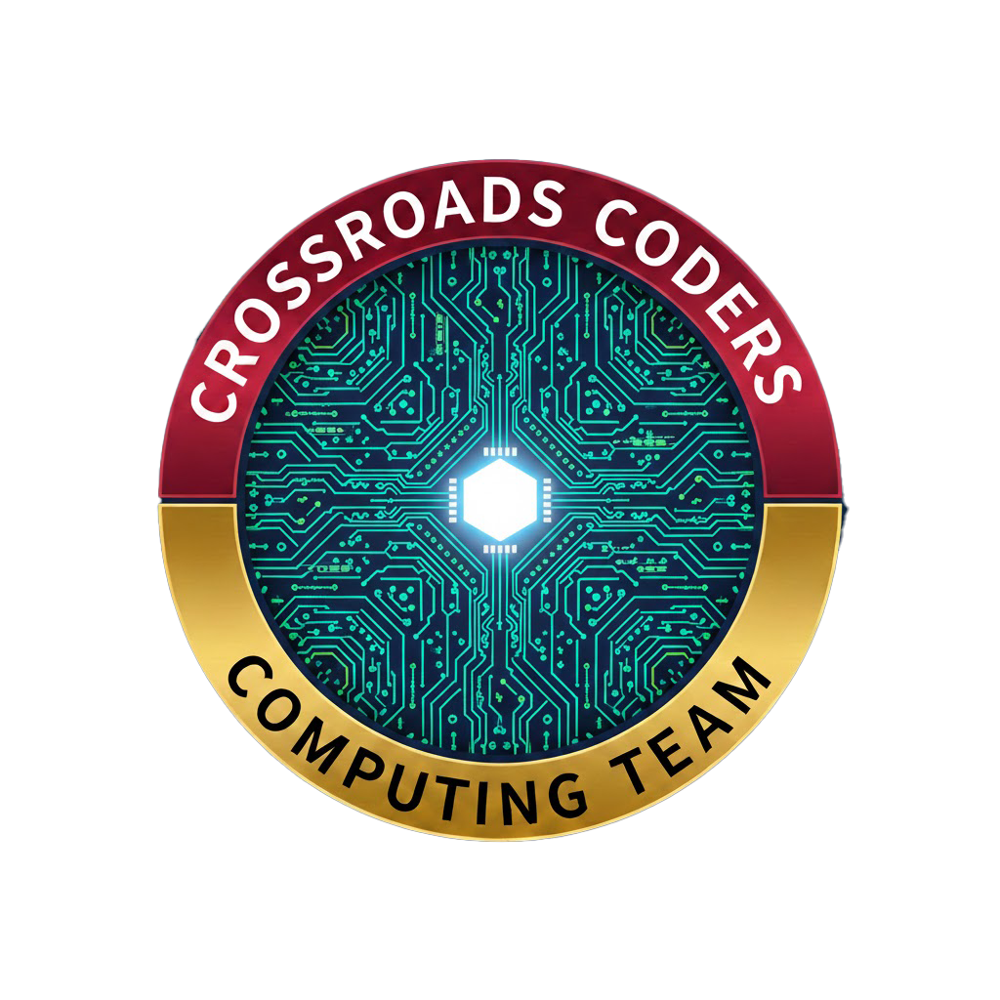
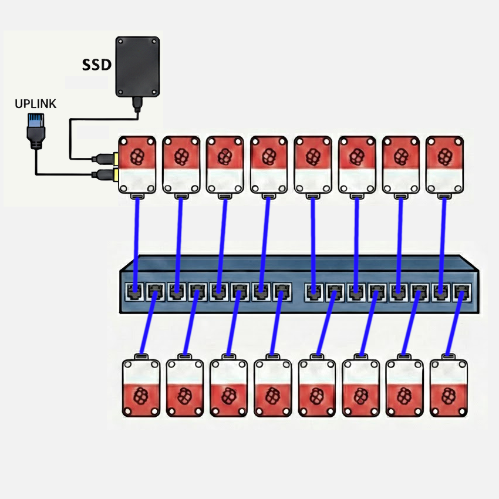

# Crossroads Coders

## Indiana University / Purdue University

## Diagram

## Hardware

Our team is running a 16-node Raspberry Pi 5 cluster with 8 GB nodes, a 1&nbsp;GbE interconnect using an unmanaged 16-port Netgear switch. A 4&nbsp;TB NVMe SSD mounted via USB 3.0 on the head node provides storage to the cluster via NFS. Access to the cluster is managed via SSH by way of a second 1&nbsp;GbE USB 3.0 adapter on the head node. The USB 3.0 ports on the Raspberry Pi 5 support individual connections at up to 5&nbsp;Gbit/s. The cluster power is monitored by a single Shelly Gen4 smart plug, which provides web accessible RPC monitoring of power draw parameters. The cluster is powered by individual Raspberry Pi 5 USB-C power supplies from a power strip fed from the smart plug. Each node is cooled with an active cooler with fan, available for the Raspberry Pi 5.

The primary choice for the hardware configuration was price and ratio of processing power to electrical draw. The Raspberry Pi 5 is an excellent computer for both its price-performance and performance-power-draw ratios. It fits squarely in the COTS paradigm established by the first Beowulf clusters. With the exception of GPU acceleration, this cluster is quite capable for its cost of less than $2500. 

### Power monitoring

The expected power draw of the cluster at full load is estimated to be less than 245 W. We will provide a live updated graph of the power usage history over the required timeframe with code that pulls the power draw data at regular intervals, as JSON-formatted output. We will provide a URL to the event organizers to keep track of this data throughout the competition.

### Hardware Table 

| Item | Amount | Purpose | Expected Power Draw | Price |
| -------- | ------- |------- |------- |------- |
| Raspberry Pi 5 (8GB)  | 16  | Cluster Nodes (Head node + 15 compute nodes) each including active cooler, RTC battery, case and power supply | 208 W (13 W/node) | $2,031.20 ($126.95/node) |
| NETGEAR 16-Port Gigabit Ethernet Unmanaged Switch (JGS516) | 1 | Cluster Interconnect | 25 W | $97.89 | 
| CAT-6 Ethernet Patch Cables | 16 | Cluster Interconnect | 0 W | $68.96 |
| USB-to-1GbE Adapter | 1 | Network Uplink (Head Node) | 2 W | $22.99 |
| Samsung Pro 990 NVMe SSD (4 TB) + Sabrent EC-RGBG USB 3.2 Enclosure | 1 | Cluster Storage (Head Node NFS Server) | 8 W | $303.25 |
| **Total** |  | | **243 W** | $2,524.29|

## Software

The team is still working with Raspberry Pi OS Lite (minimal/server), which provides straightforward setup and hardware compatibility with all the features of our cluster. However, we're planning to compare the experience with Rocky Linux, knowing that it is a defacto standard in the world of HPC clusters. Ultimately, we expect to use Rocky Linux, so that we can make use of it's compatibility with effectively all elements of the typical HPC software stack, as well as repositories of pre-built and version-matched HPC packages. The team has experience with both apt and dnf/yum package management systems, and has experimented with both for the IndySCC event at SC25.

## Strategy

Our team is composed of five members of a six-person team which competed in the IndySCC (student cluster competition) at the SC25 conference. That event used the NSF ACCESS Jetstream 2 cloud infrastructure, allowing teams to create clusters of virtual machines. Our strategy is similar to that we used for the IndySCC. We plan to identify those activities we each feel most comfortable with, playing to our individual strengths, while working in pairs, so that nobody is stuck with a difficult task and nobody to discuss it with. We have found this strategy to work well, and it allows us to work in different pairing on different elements of cluster configuration, software building, and program execution. We also know that this approach doesn't leave the team without a person who knows how to do any particular task, in the event that a team member is sick or otherwise unavailable. You might think of it as cross-training.

### Benchmarks

We apply the same paired approach to building and running benchmarks. In preparation for the IndySCC, we practiced building and configuring the HPL benchmark. We also built several other benchmarks to look at parallel code performance in algorithms with less-than-perfect scaling and which were memory-bound and I/O-bound, rather than compute bound like the HPL dense matrix problem. It was also helpful to look at build processes beyond simple Makefiles.

### Applications

Again, our paired approach to working on multiple applications, both building them and running them, has proven to be the best strategy in the one competition in which our team has participated. Admittedly, this can become a situation where one pair of students completes their task quickly and is able to help solve challenges faced with another application. This was certainly true in the IndySCC, where the balance of work to build applications was significantly unbalanced.

## Team Details

- Sky Angeles - Sophomore Computer Science major, Indiana University
- Gautam Hari - Senior Computer Science major, Indiana University
- Tri Nguyen - Senior Computer Science major, Indiana University
- Ryan Jacobson - Senior Computer Science major, Indiana University
- Dominic Yoder - Senior Computer and IT major, Purdue University