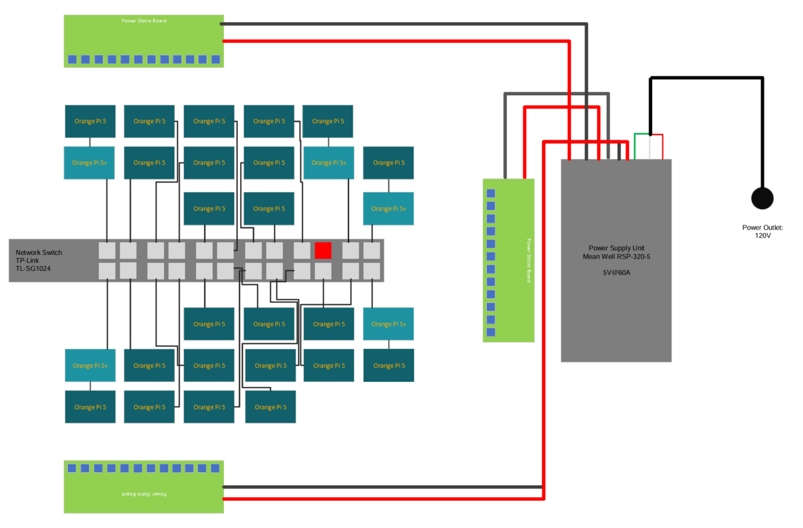

# KU Supercomputing Club

## University of Kansas

## Diagram

## Hardware

1. **Bill of Materials (BOM)**
Below is a table describing our cluster’s hardware BOM, with network hardware included:

| Item | Cost (per unit) | # Items | Total Cost | Product Link |
| --- | --- | --- | --- | --- |
| Power Supply | $36.19 | 1 | $36.19 | [Amazon](https://a.co/d/aef7134) |
| Ethernet Switch | $89.99 | 1 | $89.99 | [Amazon](https://a.co/d/80uFMTU) |
| Power Strip | $8.99 | 1 | $8.99 | [Amazon](https://a.co/d/9DdrLzO) |
| Power Distribution Board | $38.00 | 3 | $114.00 | [Amazon](https://a.co/d/7JitnBU) |
| Power Monitor | $15.99 | 1 | $15.99 | [Amazon](https://a.co/d/8LErGh1) |
| Ethernet cable (grey, 100ft) | $60.00 | 1 | $60.00 | [McMaster](https://www.mcmaster.com/8245K31-8245K14/) |
| 14AWG supply wires (Black/Red, 50ft) | $23.16 | 2 | $46.32 | [McMaster](https://www.mcmaster.com/8054T17-8054T378/) |
| 24AWG supply wires (Orange, 50ft) | $6.15 | 1 | $6.15 | [McMaster](https://www.memaster.com/8054T12/) |
| 24AWG supply wires (Black, 50ft) | $6.15 | 1 | $6.15 | [McMaster](https://www.mcmaster.com/8054T12/) |
| Ethernet RJ45 connectors (10-pack) | $10.55 | 10 | $105.50 | [McMaster](https://www.memaster.com/68995K67/) |
| Heatsinks | $8.99 | 15 | $134.85 | [Amazon](https://www.amazon.com/dp/B091KMJKY4/ref=sspa_dk_detail_1) |
| Orange Pi 5+ | $289.99 | 5 | $1449.95 | [Amazon](https://www.amazon.com/Orange-Pi-Rockchip-Frequency-Development/dp/B0C5C2CDGX?th=1) |
| Orange Pi 5 | $269.99 | 14 | $3779.86 | [Amazon](https://a.co/d/hcaDbo4) |
| TOTAL COST  |  |  | $5853.94 |  |

2. **Hardware & Network Notes**
- Internet Connection: On our diagram the Red Ethernet Port is strictly reserved for the cluster's internet connection only.
- Power Efficiency: Estimated maximum power consumption for the cluster is approximately **171.3W**.

## Software
| Feature | Software Used |
| --- | --- |
| Operating System | Armbian Linux 25.8.1 Bookworm CLI (Kernel 6.12.55) |
| C/C++ Compilation | GNU Compiler Collection (GCC) |
| Job Scheduling | Slurm |
| MPI Implementation | MPICH |
| BLAS Implementation | OpenBLAS |
| Package Management | Spack / APT |

## Strategy
* **HPL:** Focus on OpenMP support within OpenBLAS to reduce intra-node communication overhead.
* **D-LLAMA 3 8B:** Compare BLAS implementations and evaluate quantization benefits for the cluster setup.
* **MDTest:** Experiment with tuning on a base POSIX file system.
* **IQ-TREE:** Utilize official documentation and tutorials for education and execution.
* **Mystery Application:** Research the provided application to ensure completion within the allotted time.

## Team Details
Our team is comprised of five (5) University of Kansas (KU) undergraduate students that are active members of KU’s Supercomputing Club. Below is the team roster and member backgrounds:

|Name | Background |
| - | - |
| Adam Berry (Captain) | Senior in Computer Science, Software Dev. |
| Alex Rawson | Junior in Computer Science, President of Information Security Club. |
| Barret Brown | Senior in Computer Science, Software Dev. |
| Ruben Pino-Martinez | Junior in Computer Science, Applied Computing/Arduino Research. |
| Wyatt Sullivan | Undergrad student, Computing and Physics focus.|
| Ky Le | Masters Student. |