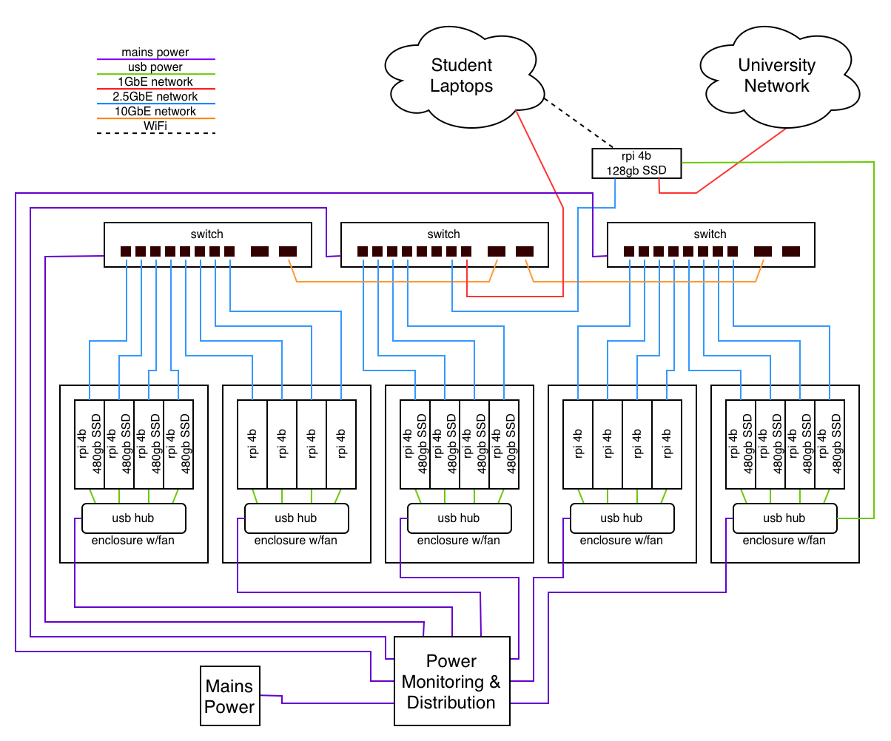

# Gigadawgs

## Mississippi State University

## Diagram

## Hardware

Hardware was selected based on budget, availability, and our familiarity with the platform. The design builds on a configuration the student organization has successfully used before, ensuring compatibility with the internal documentation and tooling we’ve already developed.

A key design decision was to prioritize improved networking capabilities over the built‑in networking found on standard Raspberry Pis. In multi‑node computing, the Pis themselves are rarely the primary bottleneck, network throughput and latency usually are. Strengthening the network layer therefore provides a more meaningful performance gain.

Additionally, storage is distributed across the cluster to enhance overall performance and resilience, with several Raspberry Pis serving as both compute and storage nodes.

### Power monitoring
The current plan for power monitoring is to use a Kill‑A‑Watt meter connected at the point where the cluster and its networking equipment draw mains power, with its readings livestreamed for real‑time observation.

### Hardware Table

| Item                                       | Amount | Purpose         | Expected Power Draw/Unit (W) | Price/Unit (USD) |
| ------------------------------------------ | ------ | --------------- | ---------------------------- | ---------------- |
| Raspberry Pi 4B 4GB                        | 21     | Compute/Head    | 7                            | 75               |
| GigaPlus 8x2.5GbE/2x10Gsfp Ethernet Switch | 3      | Interconnect    | 15                           | 65               |
| 2.5GbE USB NIC                             | 21     | Interconnect    |                              | 10               |
| 10GbE SFP+ DAC                             | 2      | Cabling         |                              | 10               |
| 128GB M.2 Sata drive                       | 1      | Head Storage    |                              | 45               |
| SATA Cable USB cable                       | 12     | Cabling         |                              | 10               |
| 480gb sata ssd                             | 12     | storage         |                              | 99               |
| 1ft cat6 patch cables                      | 21     | cabling         |                              | 2                |
| usba-c cables                              | 21     | cabling         |                              | 1.5              |
| usb charger                                | 5      | power           |                              | 26               |
| pi4 cluster enclosure w/ fan               | 5      | chassis/cooling | 1.5                          | 70               |
| Pi4 enclosure w\ headsink & fan            | 1      | chassis/cooling | 0.25                         | 40               |

## Software

| Purpose             | Software Name                |
| ------------------- | ---------------------------- |
| Operating System    | Rocky Linux 9.5 Kernel: 5.14 |
| C/C++ Compiler      | GNU Compiler Collection      |
| Job Scheduler       | Slurm                        |
| MPI Implementation  | OpenMPI, mpi4py              |
| BLAS Implementation | OpenBLAS                     |
| Package Managment   | RPM, Spack                   |
| Booting System      | WareWulf                     |

## Strategy

### Benchmarks

**HPL**: Perform an *N* and *NB* parameter sweep to identify the optimal problem size that maximizes TFLOPS.

**D-LLAMA**: Evaluate the trade-offs between 4-bit/8-bit quantization to achieve the highest possible token-per-second throughput for Llama 3 8B.

**MDTest**:Tune the parallel file system metadata servers and experiment with directory stripping to maximize IOPS for file creation and stat operations.

### Applications

**IQ-TREE**: Implement a hybrid MPI+OpenMP execution model to minimize communication overhead while maximizing core utilization during complex phylogenetic tree reconstructions.

**Mystery Application**: Assign a 2-3 person team based on the individual strengths of the team members.

## Team Details

| Name | Skills | Competition Responsibilities |
| :--- | :--- | :--- |
| **Jamie Anderson** | - Hardware Configuration - Basic Networking - OS Installs - Software Troubleshooting | - Helping with hardware and OS/software configuration - Helping administer system to rest of the team |
| **Isha Shrestha** | - AI/ML - Distributed Computing - Data Science | - Helping with D-LLAMA, MDTest and IQ-TREE |
| **Edward Cruz** | - Software & Environment Mgt. - Performance & Res. Monitoring - Storage & Filesystems | - Helping with IQ-TREE and MDTree |
| **Niraj Gupta** | - AI/ML  - Data Science - Computer Vision | - Helping with HPL |
| **Soyb Karki** | - Distributed Systems   - Software Engineering   - AI | - Helping with HPL and MDTest |
| **Kavya Gautam** | - AI/ML - Distributed Computing - Data Science | - Helping with D-LLAMA |
| **Anoop Mishra** | - AI/ML - Data Science  - Linux  | - Helping with IQ-TREE |
| **Travis Greene** | - Hardware & Software Configuration - Networking - OS Install & Config - LDAP - Build Systems | - Sysadmin, install & configuration - LDAP & permissions - Cluster communication |