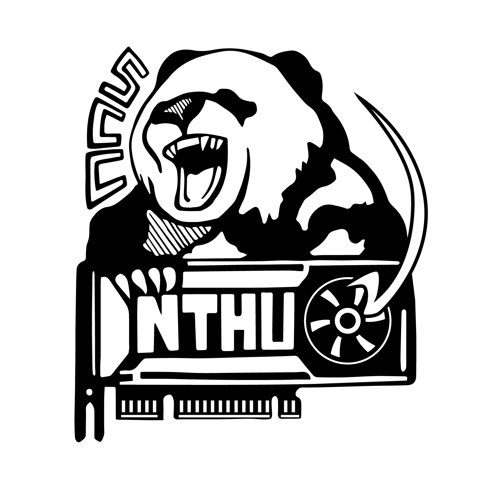
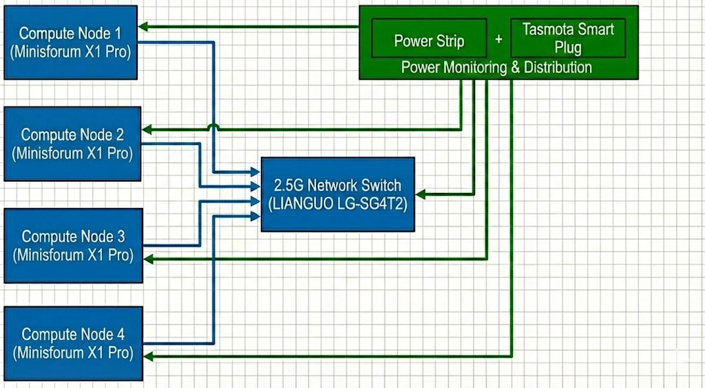

# Team NTHU

## National Tsing Hua University

## Diagram

## Hardware

For this competition, we will be using an AMD Mini PC cluster with 4 nodes. The Ryzen AI 9 HX 370 provides the latest Zen 5 architecture, which offers significant IPC improvements, crucial for high-performance numeric computing within a limited power envelope.

To strictly adhere to the 250W power limit, we will use cTDP (Configurable TDP) scaling to limit each node's package power. Given the total budget, each node will be capped at approximately ~60W (depending on the switch's overhead) to ensure the entire system remains stable under peak load.

### Power monitoring

We will implement a real-time power monitoring system using Tasmota-flashed smartplugs. These plugs provide high-frequency power consumption data via their local API. We will deploy a Prometheus + Grafana stack to aggregate this data, providing the committee with a live, historical dashboard of the cluster's total power draw.

### Hardware Table

| Item | Amount | Purpose | Expected Power Draw | Price |
| --- | --- | --- | --- | --- |
| Minisforum X1 Pro Mini PC | 4 | Main nodes | 60~80W | $1350 per unit / $5400 in total |
| LIANGUO LG-SG4T2 | 1 | Network switch | 12W | $25 |

## Software

**Rationale:** Our software stack is carefully selected to extract the maximum performance-per-watt from the heterogeneous Ryzen AI 9 APU. By maintaining a diverse suite of compilers (AOCC, LLVM, GCC, OneAPI), we can empirically determine the best AVX-512 vectorized binary for each specific workload. For distributed computing, we combine various MPI implementations with UCX and XPMEM to minimize latency over our 2.5G network and ensure high-speed intra-node communication. Finally, our comprehensive profiling toolchain (AMD uProf, rocprof, VTune) allows us to surgically identify and eliminate compute, memory, and power bottlenecks during the competition.

### System & Compilers

* OS: Ubuntu 24.04 LTS
* FS: CephFS
* Intel OneAPI
* AOCC 5
* GNU 13
* LLVM

### LIBs

* OpenBLAS
* AOCL-BLAS

### Profile Tools

* VTune
* iPerf
* AMD uProf (For System & CPU profiling)
* rocprof (ROCm Profiler for GPU)
* AMD Radeon GPU Profiler

### MPI & Communication

* IntelMPI
* OpenMPI
* MVAPICH4
* UCX
* XPMEM

### Other

* Scheduler: HyperQueue

## Strategy

### Benchmarks

#### HPL

With the enabling of ROCm on newer Linux kernels, we will pivot from a CPU-only approach to an iGPU-accelerated HPL. By offloading GEMM operations to the 16 RDNA 3.5 CUs via hipBLAS, we expect a significant increase in performance-per-watt compared to pure AVX-512 execution. We will balance the cTDP to ensure the iGPU has enough thermal headroom to maintain high clock speeds.

### Applications

#### D-LLAMA

Distributed-LLaMA (D-LLAMA) utilizes any device as a cluster machine and provides great AI capabilities. Given limited discrete GPU accelerators and fixed hardware constraints, we optimize the application mainly for CPU devices, ensuring the binaries fully exploit the underlying microarchitecture (such as AVX-512 and FMA instructions inherent to our AMD Ryzen environment) across the cluster. For more aggressive optimization, we are implementing a zero-copy networking backend. By bypassing the traditional kernel TCP/IP stack, we aim to reduce memory-to-network latency when exchanging tensor activations.

D-LLAMA is highly sensitive to parallel efficiency and communication overhead. To address this, we take a dynamic, topology-aware layer distribution strategy. Furthermore, adopting advanced quantization formats and enforcing strict CPU memory affinity (thread pinning) will significantly improve L2/L3 cache hit rates and KV-cache reuse during continuous inference runs.

#### MDTest

MDTest evaluates I/O metadata performance under intensive MPI communication; therefore, minimizing data transfer overhead between nodes is crucial. By enabling Jumbo Frames, network throughput is enhanced by packing more data per transmission, which effectively decreases packet processing overhead and relieves network congestion.

#### IQ-TREE

* **Vectorization:** We will use AVX-512 optimized builds of IQ-TREE to accelerate likelihood calculations, which is highly effective on the Zen 5 microarchitecture.
* **Task Distribution:** Utilizing HyperQueue to manage the massive number of tree-search tasks across the available threads in the cluster.

#### Mystery

Determine if the application is better suited for Vulkan-based or ROCm-based GPU acceleration or high-frequency CPU execution.

## Team Details

| Name         | Skills               | Interests |
| ------------ | -------------------- | --------- |
| Guan-Yu Ji   | System Optimization  | HomeLab   |
| Jonathan Hsu |  Profile |  Motorcycle        |
| Ke-Ying Chen | Parallel Programming | Trading   |
| Chien-Lin Li |    Distributed Optimization     |  Rhythm Games   |
| Ming-Yang Zheng | Algorithm Optimization | Badminton |
