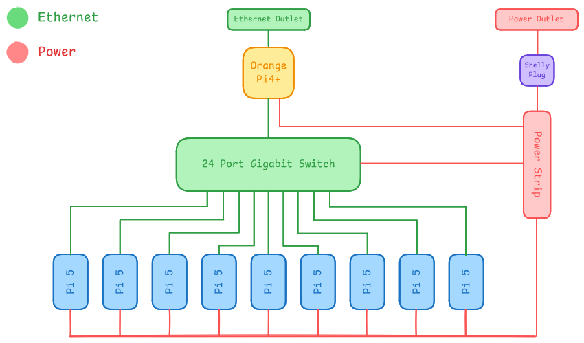

# PlumJuice

## Sapienza University of Rome

## Diagram

## Hardware

Our hardware strategy focuses on maximizing compute density while maintaining a production-grade management layer.

- **Head Node and Management**: For our head node, we utilize an Orange Pi 4+. This node acts as the cluster's Internet Gateway, routing traffic between the external competition network and our internal subnet. It also functions as the Control Node, hosting the Slurm controller (slurmctld) and serving a centralized NFS share. This ensures that all worker nodes have a consistent environment for binaries and home directories, which is critical when using Spack for package management.

- **Compute Nodes**: The compute fabric consists of nine Raspberry Pi 5 nodes.

- **Interconnect and Power**: Networking is facilitated by a Tenda TEG1024D 24-port Gigabit switch, providing ample non-blocking bandwidth for internal cluster traffic. Power is centralized through a single power strip monitored by a Shelly Plug, allowing us to report live power metrics to the committee.

### Hardware Table 

| **Item** | **Amount** | **Price (per unit)** | **Total Price** | **Expected Power Draw (per unit)** | **Cumulative Power Draw** | **Link** |
| --- | --- | --- | --- | --- | --- | - |
| Raspberry Pi 5 (4GB) | 6 | 105 USD | 630 USD | 5-10 W | 30 - 60 W | https://www.kubii.com/en/nano-computers/4106-1831-raspberry-pi-5-3272496315938.html#/ram-4_gb |
| Raspberry Pi 5 (8GB) | 3 | 160 USD | 480 USD | 5-10 W | 15 - 30 W | https://www.kubii.com/en/nano-computers/4106-1832-raspberry-pi-5-3272496315938.html#/ram-8_gb |
| Orange Pi 5 Plus (8GB) | 1 | 220 USD | 220 USD | 7-15 W | 7 - 15 W | https://orangepi.net/product/orange-pi-5-plus-8gb-ram |
| Cooling Fans for Raspberry Pi 5 | 9 | 7 USD | 63 USD | 1-3 W | 9 - 27 W | https://www.kubii.com/en/fans-heat-sinks/4109-cooling-fan-for-raspberry-pi-5-5056561803357.html |
| Official Raspberry Pi 27W USB-C Power Supplies | 10 | 15 USD | 150 USD | 1 W | 10 W | https://www.kubii.com/it/alimentatori/4107-1818-alimentatore-raspberry-pi-27w-usb-c-3272496315761.html#/colori-bianco/version_d_alimentation-unione_europea_ue |
| Tenda TEG1024D 24-Port Gigabit Ethernet | 1 | 75 USD | 75 USD | 15 W | 15 W | https://www.amazon.it/Tenda-TEG1024D-Sdoppiatore-Montaggio-Struttura/dp/B002T4WXVO/ref=asc_df_B002T4WXVO?mcid=b2079ded079b3da48e4a2d3b2490663f&tag=googshopit-21&linkCode=df0&hvadid=700813659490&hvpos=&hvnetw=g&hvrand=13950705490473897463&hvpone=&hvptwo=&hvqmt=&hvdev=c&hvdvcmdl=&hvlocint=&hvlocphy=9217543&hvtargid=pla-1305966201998&hvocijid=13950705490473897463-B002T4WXVO-&hvexpln=0&th=1 |
| **Total** |  |  | **1618 USD** |  | **90 - 160 W** |  |

## Software

Our stack is designed to mirror an enterprise HPC environment, prioritizing reproducibility and performance:

- **Operating System**: Rocky Linux (ARM64) is deployed across all nodes to provide a stable, RHEL-compatible base for scientific software.

- **Workload Management**: Slurm is used for job scheduling and resource orchestration, ensuring optimal CPU affinity and task distribution.

- **Package Management**: Spack is our primary tool for building the software stack. It allows us to compile optimized, architecture-specific versions of libraries like OpenBLAS and OpenMPI.

- **Environment Management**: Lmod provides a clean hierarchical module system, allowing users to easily load and swap software environments for different benchmarks
  
## Strategy

### Benchmarks

- **HPL**: Our strategy relies on utilizing Spack to build a highly tuned OpenBLAS library. We will focus on finding the optimal P×Q grid and block sizes while using Slurm to pin processes to physical cores, eliminating context-switching overhead.

- **MDTest**: We will optimize the NFS configuration on the Orange Pi 4+ to minimize metadata latency. By tuning mount options and leveraging the head node's dedicated CPU for I/O handling, we aim to sustain high file-operation rates across the cluster.

### Applications

- **DLLAMA**: We will utilize quantization (4-bit/8-bit) to manage the 4/8GB memory constraints of the Pi 5. Our goal is to balance model accuracy with inference speed by optimizing distributed tensor weights over our gigabit interconnect.

- **IQ-Tree**: We will leverage the cluster's 36-core fabric by distributing phylogenetic likelihood analyses through Slurm.

- **Mystery Application**: Our Spack + NFS stack allows for "Build Once, Run Everywhere." We can compile the mystery app on the head node and instantly deploy it to all workers, significantly reducing the "time-to-first-result."

## Team Details

Our team is supported by a senior group of Master’s students at Sapienza who bring a wealth of practical experience from international competitions. Having competed in IndySCC25 and currently preparing for ISC26, they serve as our technical advisors. This mentorship is helping us bridge the gap between theory and practice, particularly in fine-tuning our software stack and developing a solid workflow for competition-day troubleshooting.

- **Jacopo Mazzatorta** (Team Lead)
Jacopo is a 26-year-old student with a unique background in Economics, currently transitioning into Computer Science. His focus is on Systems Architecture and Parallel Programming. Within the team, he manages the high-level cluster orchestration and hardware optimization. He is particularly passionate about finding the most efficient way to scale software across powerful hardware clusters, and is also preparing to compete at IndySCC26.

- **Alessandro Milos**
  Alessandro is a third-year Computer Science bachelor’s student with a strong interest in parallel programming and distributed systems. This is his first time participating in a cluster competition. He is particularly focused on understanding how interconnected systems coordinate and scale. Through this experience, he aims to deepen his knowledge of high-performance computing environments and communication protocols.

- **Jacopo Rallo**
  Jacopo is a third-year Applied Computer Science and Artificial Intelligence student. He is currently exploring the fields of parallel programming and HPC, areas that have captured his growing interest. As a participant in IndySCC26, he aims to further sharpen his technical expertise and gain high-level hands-on experience in the field.

- **Pietro Piccolo**
  Pietro is an ACSAI student at Sapienza University, specializing in the practical application of Artificial Intelligence to solve real-world problems. With a keen interest in software scalability and algorithmic efficiency, he bridges the gap between theoretical computer science  user-centric technology.