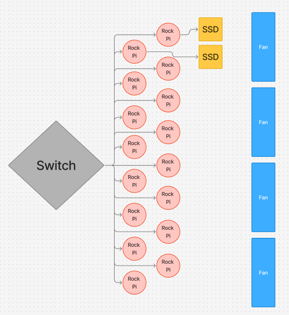

# Those Who Node

## San Diego Super Computing Center / University of California, San Diego

## Diagram

## **Hardware:**

- For our cluster, we use 15 Rock Pi 5Bs  
  - They are connected to our switch via a cat6 ethernet cable  
  - We power the Rock Pis via USB-C power cables  
- 2x MV-V7E500 500GB SSDs (1 TB total)   
  - 1 SSD will be on the login node, while the other will be on a different node (we may call this the secondary login node)   
- Jetson TX2 

### **Power monitoring**

During the early stages, we will set up node\_exporter on all the nodes in our cluster to export power draw estimates, and use Prometheus and Grafana to collect and visualize the data. We will eventually use a queryable metered PDU to measure our cluster’s exact power draw, including the switch and peripherals. 

### **Hardware Table/Bill of Materials**

| Part | Units | Wattage/Unit | Cost per unit | Total Price |
| :---- | ----- | ----- | ----- | ----- |
| [RADXA Rock Pi 5B (16 Gb RAM)](https://radxa.com/products/rock5/5b/#techspec) | 16 | [12](https://github.com/geerlingguy/top500-benchmark) | 199.90 | $3198.4 |
| [Unifi Switch 48](https://techspecs.ui.com/unifi/switching/usw-48?s=us) | 1 | 40 | $399.00 | $399.00 |
| MV-V7E500 500GB SSD | 2 |  | $79.00 | $158.00 |
| Enclosure (DIY) | 1 | 0 | $79.92 | $79.92 |
| Fan | 4 | 1.56 | 7.90 | $31.6 |
| Jetson TX2  | 1 | 10W | $549.00 | $549.00 |
| **TOTAL COST** |  |  |  | $4415.92 |

## **Software:**

Our software stack is as follows:

- **Operating System:** Our system runs Armbian 25.11.1, as it is a lightweight linux distribution that is optimized for ARM hardware.  
- **Cluster Management:** We manage the machine state, including creating users, managing shared files, and installing packages using multiple ansible scripts for simplicity and cluster reproducibility.   
- **Operational Security:** We disable root login and password-based authentication, and use key-based access control for all users across the cluster.  
  - Users access the cluster via a login node with the hostname rock0  
- **Container Runtime:** Docker is installed on cluster nodes to support nodes to support containerized tools  
- **GPU Runtime Support:** We provision Vulkan packages and ICD config so GPU intensive tasks can be tested consistently  
- **Job Scheduling:** We will use Slurm for job scheduling, allowing us to manage and run jobs even when away from the cluster.  
- **Package Management:** We manage dependencies across the Pis using Spack, allowing us to easily load modules when required for a task.  
- **Filesystem Management:** We have shared directories across the Pis, allowing for convenient access to modules and apps in a uniform location across the cluster. The shared directories are mounted using NFS.   
- **Communication:** To run applications across the cluster, we use Open MPI 4.1.6.   
- **Compiler:** We use the GCC compiler for compiling.   
- **Application and Benchmark Dependencies:**  
  - HPL: OpenBLAS 0.3.30 and OpenMPI 4.1.6  
  - IQ Tree: Eigen 3.4.0, OpenMPI 4.1.6, and GCC 14.2.0  
  - Dllama: GCC 14.2.0 and Python 3.13.5  
  - MDTest: GCC 14.2.0 and OpenMPI 4.1.6

## **Strategy:**

### **Benchmarks**

HPL:

- We will use spack to easily load in and manage modules across the cluster. We will use Open MPI and OpenBLAS to compile and run HPL, with OpenBLAS compiled specifically for parallelized MPI environments. The bulk of our focus will be on tuning HPL parameters for maximum performance on our cluster \- we intend to try multiple strategies for this, including brute force searches and Bayesian optimization. 

MDTest:

-  For MDTest, I plan on focusing on how different MPI binding and mapping configurations affect the run time of MDTest, as well as measuring the speed and time of running MDTest through a shared NFS directory or through separate local directories, and tune my MDTest run settings accordingly to achieve maximum speed and minimize variation. I also intend to identify important bottleneck points in metadata, as well as limits in per node storage. 

D-LLAMA:

- For D-LLAMA, we first profile the full inference run to find the main bottleneck (compute, memory, sync, or network). Then we apply simple high-impact fixes like cleaning up setup, removing extra copies, improving scheduling, and cutting unnecessary synchronization. After the baseline is stable and faster, we add Rock Pi accelerators (GPU and NPU where it makes sense) to offload the most expensive work. If we still have time, we try pipeline parallelism or a tensor–pipeline hybrid to reduce communication and scale better across nodes.

### **Applications**

IQTree:

- For IQ-TREE, we first study the application itself, what biological problem it solves, how it consumes multiple sequence alignment data, and where the heavy computation actually happens in the likelihood search. Then we profile a full run to identify the dominant bottleneck: pure compute, memory pressure, or MPI communication overhead.  Once we understand the baseline behavior, we apply high-impact optimizations: compiling specifically for ARM to maximize floating-point performance, ensuring efficient MPI configuration, reducing unnecessary data movement, and staging input locally to avoid I/O bottlenecks. After stabilizing single-node performance, we benchmark strong scaling across nodes to measure parallel efficiency and identify when communication begins to limit gains. If scaling drops, we focus on improving load balance, adjusting process placement, and tuning MPI parameters to reduce synchronization and network overhead. Throughout, we validate changes with repeated, controlled benchmarks on fixed alignment datasets so every improvement is measurable and justified.

Mystery Application: 

- For the mystery application, we will ensure that all of our team members have a solid understanding of our system, comfort with HPC concepts, and an understanding of commonly used tools so that we can work quickly once the application is revealed. We also plan on reviewing documentation from previous UCSD teams to better understand how the mystery application can be conducted and optimized. 

## **Team Details:**

Cecilia Li 

- My name is Cecilia Li. I’m a second-year Electrical Engineering student. I competed in SBCC 25 and SCC 25. I am interested in digital IC, ASIC design, and ML sys. I am working on HPL and IQ-Tree.

Tom Lu

- My name is Tom Lu, a second year Computer Science major at UCSD. I participated in SC25 as a home team member, and this is my first time participating in SBCC. I’m interested in Computer Architecture, Hardware-Software Co-Design, and Parallel Computing.

Chanyoung Park

- My name is Chanyoung Park, and I’m a third-year Data Science student at UC San Diego. I competed in SBCC 2025 as a team member and participated in SCC 2025 as an alternate. I’m especially interested in hardware acceleration, machine learning systems and architecture, and performance optimization.

Chetan Thotti

- My name is Chetan Thotti, and I'm a first-year Computer Science major at UC San Diego. This is my first time competing in SBCC or any related competitions, so I don't have prior experience. I became interested in high-performance computing because of how rapidly the world's data usage is growing, and I'm curious about the ways we process and manipulate large-scale data across different applications. I'm specifically working on tuning HPL and optimizing D-LLAMA.

Ibrahim Altuwaijri

- My name Is Ibrahim Altuwaijri, I'm a third year Computer Engineering major at UCSD. I'm interested in computer architecture and distributed systems. I have some experience with running software using MPI. And designing  IoT devices.

Yixuan Li

- My name is Yixuan Li, and I’m a second-year Computer Science Major at UCSD. I competed in SBCC 25 as UCSD Team 2’s sysadmin, and I also participated in SCC 2025 as an alternate. I’m mainly working on system setup, administration, and networking. 

Aidan Tjon

- My name is Aidan Tjon, and I'm a first year student at UC San Diego studying Artificial Intelligence. I participated in SCC 2025 as a home team member. I'm interested in high performance computing, specifically building reproducible environments on Linux, working with clusters and schedulers like Slurm, and tuning workloads so they actually run fast and reliably.

Yuting Duan

- My name is Yuting Duan, and I’m a third-year Computer Science transfer student at UC San Diego. This is my first time participating in SBCC. I’m interested in high-performance computing and how computational power can be used to build software that supports scientific research and simulation.
