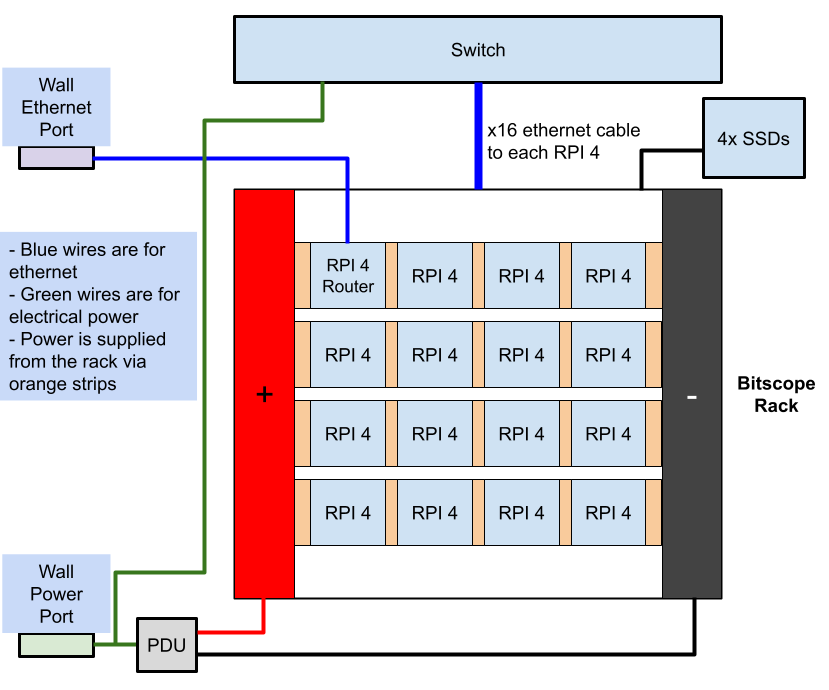

# Penguin Warriors

## San Diego Super Computing Center / University of California, San Diego

## Diagram

## Hardware

We plan to use one Raspberry Pi 4 as a login node, which will also act as a router. This node is the only node that can be accessed through the internet. The rest of the nodes will be connected to a switch through Ethernet connections, and can be accessed through the login node via ssh. We are connecting 4 SSDs to 4 Raspberry Pi 4s, 1 SSD to each Pi.

## Power monitoring  
We plan to set up a Grafana display on our team website for the supervising committee to monitor.

## Hardware Table 

| Item | Amount | Purpose | Expected Power Draw | Price |
| :---- | :---- | :---- | :---- | :---- |
| Raspberry Pi 4B | 16 | Computing Equipment | 10W \* 16 \= 160W | $1200 |
| Lexar 64GB Micro SD | 16 | Storage | N/A | $224 |
| NETGEAR 24-Port Gigabit Ethernet Unmanaged Switch (JGS524) | 1 | Switch | 40W | $150 |
| Intel SSD DC S4500 Series 240GB | 1 | Storage | 3W | $155 |
| Intel SSD DC S3520 Series 240GB | 1 | Storage | 3W | $189 |
| Intel SSD DC S3500 Series 300GB | 1 | Storage | 3W | $170 |
| Intel SSD D3-S4510 Series 240GB | 1 | Storage | 3W | $154 |
| Power Supply | 1 | Supply power | N/A | $90 |
| Fan | 1 | Cooling | 10W | $20 |
| Short ethernet cable | 16 | Switch Connection | N/A | $25.44 |
| Long ethernet cable | 2 | Connection to outside internet | N/A | $20 |
| Bitscope Rack | 1 | Rack | N/A | $950 |
| USB-C Power cable | 1 | Power supply to the power supply | N/A | $16 |
| Power Cables | 3 | Power supply to rack | N/A | $18.27 |
| Power Strip | 1 | Outlet to the power supply and rack | N/A | $13 |
| Additional RPI4 and SSDs Power | 4 | Power strip to RPI4 | N/A | $20 |

## Software

The operating system we have decided to use is Armbian 13 Trixie for the Raspberry Pi 4\. We used Ansible scripts to set up users and distribute ssh keys throughout the pi network to enable passwordless communication. Additionally, Ansible was used to install dependencies such as OpenMPI, G++, and OpenBLAS. We plan to install Slurm to schedule jobs and make sure we are using the cluster optimally.

## Benchmark and Application Strategy

**HPL**  
HPL will be compiled and run using OpenMPI and OpenBlas, with OpenBlas built to support efficient parallel execution. Our primary efforts will be towards systematically tuning HPL’s key parameters, N, NB, and process grid (P x Q), to maximize computational efficiency while minimizing communication overhead. Particularly, we will experiment with near P and Q configurations, test multiple NB block sizes to match cache and BLAS performance, and select N based on memory. We will monitor CPU utilization, memory usage, and communication bottlenecks to identify the highest-performing configurations for our cluster. 

Dependencies: OpenMPI, OpenBLAS, C compiler 

**MD-Test**  
To improve MDTest performance, we will deploy BeeGFS to avoid centralized metadata bottlenecks. BeeGFS distributes metadata and storage across multiple nodes, enabling true parallel file operations. By using locally attached enterprise SSDs on nodes, we reduce latency and improve metadata throughput under concurrent workloads.

Dependencies: OpenMPI, C compiler, BeeGFS

**D-LLAMA**  
We will test the 3.1 8B model extensively with various synchronization precisions and sequence lengths. We will also try running the model on all 16 pis or parallel run 2 batches of 8 pis.

Dependencies: Git, Python3

**IQ-Tree**  
IQ-Tree will be optimized through MPI flags, compiler flags, and an understanding of the processes to figure out where bottlenecks occur. Monitoring CPU usage and RAM usage is anticipated to be important.

Dependencies: C++ Compilier, Boost, Eigen3, OpenMP

## Team Details

**Ryan Estanislao**  
Ryan Estanislao is a computer science student with experience in cybersecurity and benchmarking. He worked on ICON in the SCC24 home team and the STREAM memory benchmark and password decryption during SBCC25. As a travel team member for UCSD’s SCC25 team, he worked on the Exascale Climate Emulator. Additionally, he has worked on personal projects surrounding medical imaging and object detection in gaming.

**Clover Li**  
Clover has experience with HPC through last year's SBCC, played with Raspberry Pi 4s and benchmark STREAM, including figuring out that the firewall was the reason why STREAM wasn't working. As an EE major, she is interested in system benchmarking and understanding how hardware and software choices affect application performance.

**Aidan Jang**  
I am an Electrical Engineering major interested in parallel processing. I have a strong understanding of computer hardware and architecture. I'm excited to work on and optimise the D-LLAMA benchmarks\!

**Randy Bui**  
My name is Randy Bui, a fourth-year Math Computer Science major. I have prior experience in high performance computing through being on the SCC Home Team, having worked with MLPerf. I am also interested in understanding more how to make various applications run more efficiently. I'm also in the midst of improving my system administration skills.

**Rahul Chandra**  
Rahul has prior experience in HPC through the SCC Hometeam (diagnosing HW issues and the reproducibility challenge) and an internship where he worked on benchmark design across hundreds of H100 nodes. Combined with the experience he’s gained in system administration and OS internals as a core maintainer of the Linux from Scratch book and his personal homelab, he is excited to get the most out of the hardware provided.

**William Wu**  
William has prior experience in HPC through his participation in last year's SBCC competition where he specialized in cracking passwords in parallel. William is interested in automating tasks and computing large amounts of data efficiently.

**Angie David**  
Angie is new to HPC and is gearing her work towards supporting the setup of the D-Llama benchmark. As a 2nd year Electrical Engineering major, she’s expanding her software abilities to expand her scope beyond electronics. 

**Owen Cacal**  
Owen is new to working with HPC and software, but has been actively learning about Raspberry Pis. Although he is more interested in working with hardware, he wants to expand his interests and learn more about working with software, including HPL and MD-Test.
